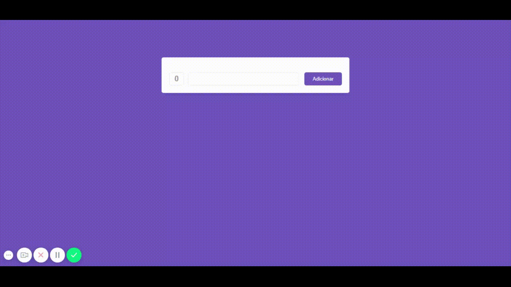

<h1 align="center">
    
</h1>

<h3 align="center">
  Código feito com as Aulas do 8° Módulo do Bootcamp - GoStack
</h3>

<blockquote align="center">“Sua única limitação é você mesmo”!</blockquote>

  <a href="#dart-sobre-o-projeto">Sobre o projeto</a>&nbsp;&nbsp;&nbsp;|&nbsp;&nbsp;&nbsp;
  <a href="#fire-sobre-o-desafio" > Sobre o desafio </a>&nbsp;&nbsp;&nbsp;|&nbsp;&nbsp;&nbsp;
  <a href="#memo-license"> License </a>

## :dart: Sobre o projeto

O projeto foi criar uma pequena aplicação estilo `To Do List` utilizando os **React Hooks**.

Para instalar e executar o projeto você precisa:

1. Fazer um clone desse repositório;
2. Entrar na pasta rodando `cd hooks-gostack-introduction`;
3. Rodar `yarn` para instalar as dependências;
4. Rodar `yarn start` para iniciar o projeto.

## :fire: Sobre o desafio

O desafio do oitavo módulo foi bem simples, era só converter o código do desafio do 7° módulo para utilizar os **React hooks** 

Para dar uma olhada :point_right: [Clique Aqui](https://github.com/maurodesouza/mobile-gostack-redux-challenge) :point_left:

## :memo: License

Esse projeto está sob licença MIT. Veja o arquivo [LICENSE](LICENSE.md) para mais detalhes.

---

Feito com :heart: by Mauro de Souza - Email: maurodesouza2017@hotmail.com
